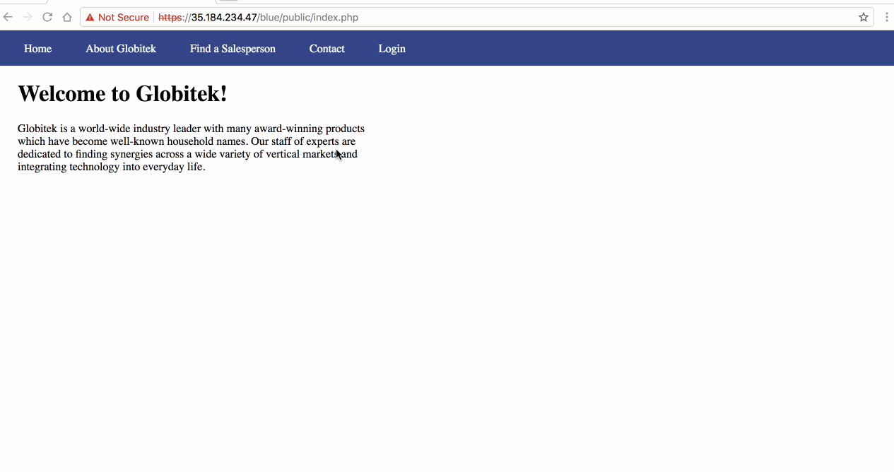
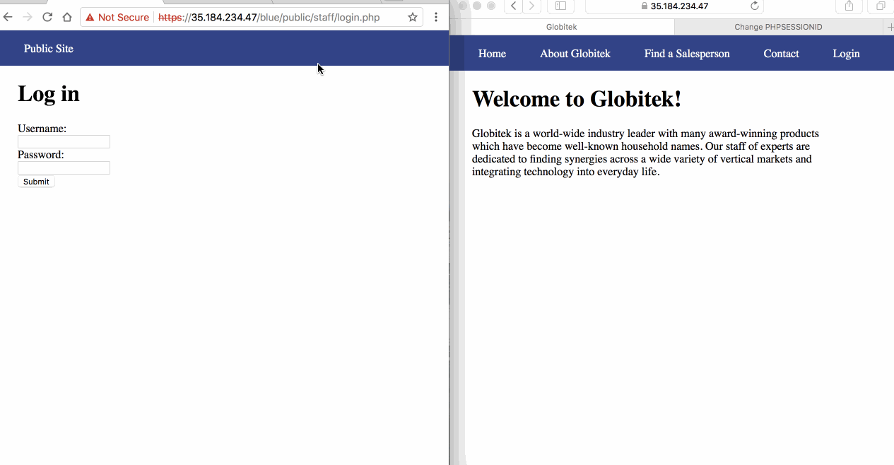
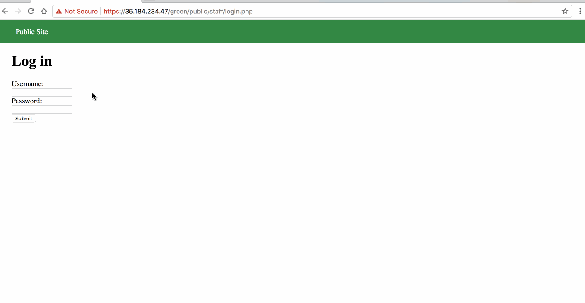
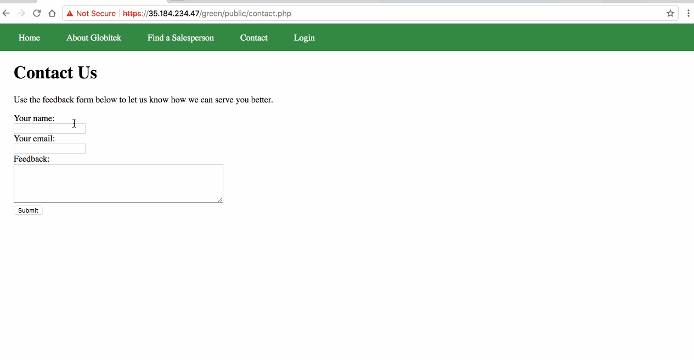
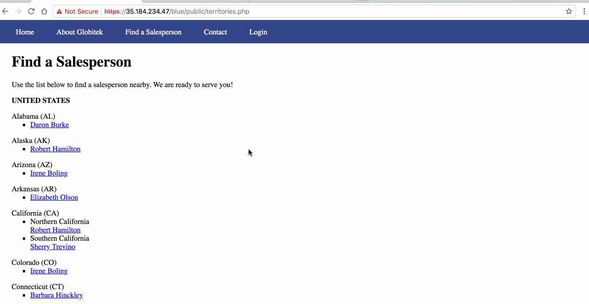
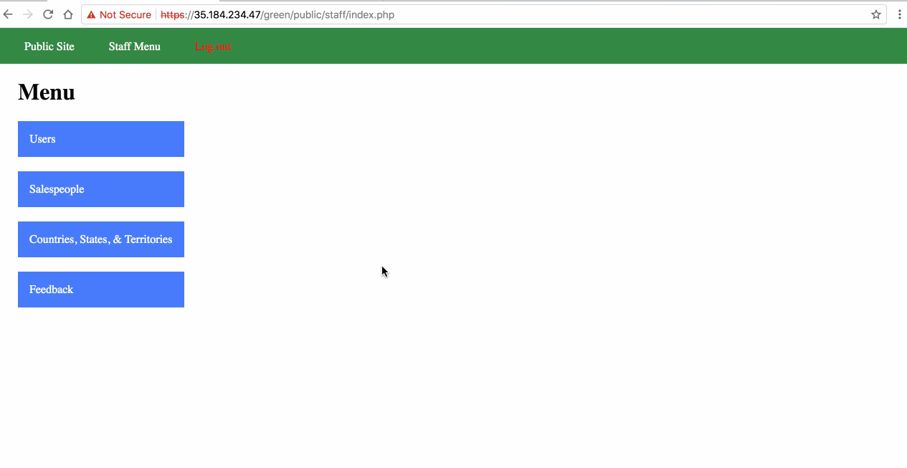
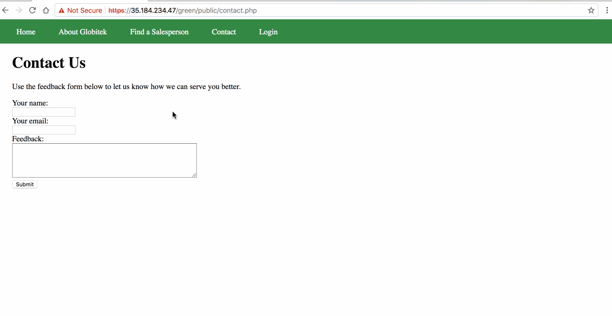

# Project 8 - Pentesting Live Targets

Time spent: **15** hours spent in total

> Objective: Identify vulnerabilities in three different versions of the Globitek website: blue, green, and red.

The six possible exploits are:
* Username Enumeration
* Insecure Direct Object Reference (IDOR)
* SQL Injection (SQLi)
* Cross-Site Scripting (XSS)
* Cross-Site Request Forgery (CSRF)
* Session Hijacking/Fixation

Each version of the site has been given two of the six vulnerabilities. (In other words, all six of the exploits should be assignable to one of the sites.)

## Blue

Vulnerability #1: SQL Injection



Select the Salesperson section, there is "?id=X" at the end of the url, by entering a ' after X (X can be from 1 to 9), the blue section will show "Database query failed" while the green and red sections just redirect. This indicates that the blue section has SQLI vulnerability. I used ```?id=' OR 1=1'--``` to testify it.


Vulnerability #2: Session Hijacking/Fixation



Login to the blue Globitek website, using this tool ```public/hacktools/change_session_id.php``` to get the session id. Then open blue Globitek website without login in another browser and set the session id to that session id, you will find that the website on another browser is also logined.


## Green

Vulnerability #1: Username Enumeration



When I trying to login using a wrong username, the alert message is in plain text. But when I triyng to login using a correct username, the alert message appeared is bold. By inspecting the page, we could found that class is "failture" for correct username. The other class is "failed" for uncorrect username.


Vulnerability #2: Cross-Site Scripting



In the Contact Us page, the script can be entered in Your Name and Feedback. For example, entering ```<script>alert('Shirong found the XSS!')</script>``` in both Your Name and Feedback, then go to feedback section in Staff Menu, the alert "Shirong found the XSS!" will appear twice. If you entern word instead of xss code in each section, then it will appear word. 


## Red

Vulnerability #1: Insecure Direct Object Reference



In the Find a Salesperson section ```https://35.184.234.47/red/public/salesperson.php?id=X```, by setting X to be 10 or 11 will give two people that can't be found in Find a Salesperson section. But in blue or green site, when you enter id=10 or id=11, then it will go back to Find a Salesperson page.


Vulnerability #2: Cross-Site Request Forgery



When I trying to edit the information after changing the value of csrd_token, red section is still able to make a change, while the other two sections show "Error: invalid request" after I changed their csrd_token. 


## Bonus Objective 2: Build on Objective #4 (Cross-Site Scripting)



In green section, using ```<script>document.location="https://www.google.com"</script>``` in Feedback in Contact Us, then go to the feedback section in Staff Menu, it should direct the page to google. Additionally, type ``` <script>alert(document.cookie)</script>``` may read the cookie data and type ``` <script>document.cookie="username=abcde"</script>```may set the cookie data.

## Notes

Describe any challenges encountered while doing the work

